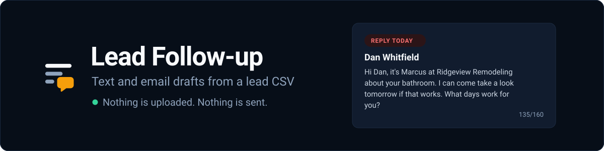
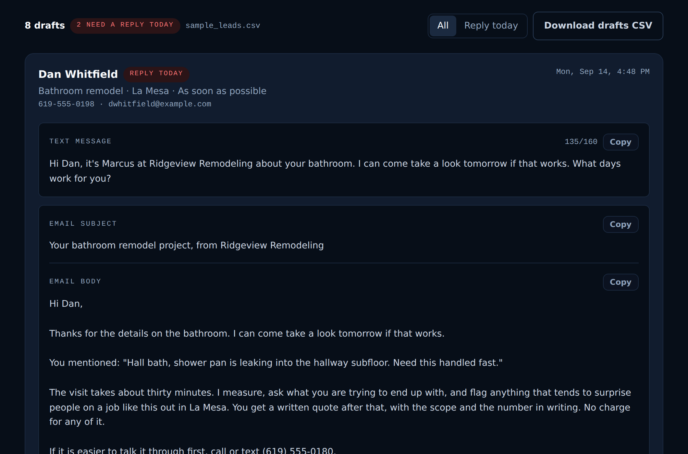

<p align="center">
  
</p>

# Lead Follow-up: CSV to same-day SMS and email drafts

A free tool that turns a CSV of leads into a ready-to-send text and email for
each one, urgent leads first, with a copy button on every draft. It runs
entirely in your browser: no account, no API key, and the file is never
uploaded anywhere.

It drafts, it never sends. A person reads each one and hits copy.

**[Open the tool](https://igorcsis.github.io/lead-followup/)** &nbsp;·&nbsp;
[The demo site that captures the leads](https://igorcsis.github.io/ridgeview-remodeling-demo/) &nbsp;·&nbsp;
[MIT licensed](LICENSE)

<p align="center">
  
</p>

## The problem it solves

A homeowner filling in a quote form at 7am has usually filled in someone
else's by 9. Whoever answers first is usually the one who gets the
walkthrough. The contractor is not going to be that person, because the lead
lands while they are on a roof with a nail gun in their hand and the phone is
in the truck.

By seven in the evening there are six of them, and each one wants a different
thing: a leaking shower pan, a wall out of a galley kitchen, an ADU over the
garage. Writing six replies that do not read like a form letter is its own
evening's work, so it waits until Thursday.

So this does the writing. Drop the export in, read what it wrote, fix anything
that is off, send them yourself.

## Try it in thirty seconds

Nothing to install and nothing to sign up for.

1. Open **[the tool](https://igorcsis.github.io/lead-followup/)**.
2. Click **Use the sample leads**.
3. Hit **Copy** on any draft.

Eight fictional leads load, the two urgent ones sort to the top, and every
draft is one click from your clipboard.

## What you get for each lead

- **A text message** naming the specific job, under the 160 character limit so
  it arrives as one message rather than three, with a live character count.
- **An email** subject that leads with "Following up on your ...", and a body
  that quotes the homeowner's own words back to them.
- **A Reply today badge** when the timeline says ASAP, as soon as possible,
  emergency, immediately, or urgent. Those sort to the top.
- **A copy button** on each of the three, because that is the entire
  interaction.

## What it deliberately does not do

**It does not send anything.** No Twilio, no SMTP, no mail API, nothing
scheduled. Every draft reaches a homeowner only after a person has read it and
pressed Copy. A tool that texts homeowners on its own is one bad row away from
an embarrassment, and it is the contractor's name on the message.

**It does not call a language model.** The drafts come from templates picked by
project type and timeline. No API key, no per-draft cost, no rate limit, no
waiting on a response, and the same lead always produces the same draft.

**It does not upload your CSV.** The browser reads the file and parses it in
memory. After the page loads there are no network requests at all, which you
can watch for yourself in the network tab: the page loads, and then it goes
quiet. The web fonts were removed so that sentence is literally true rather
than nearly true.

What it will not do is the reason it is safe to hand to somebody. There is no
account to create, no key to hold, and no bill that can arrive later.

## Running it locally

```bash
npm install
npm run dev        # http://localhost:5173/lead-followup/
npm run build      # typecheck, then a static site in dist/
npm test           # TypeScript tests, Python tests, and the parity check
```

Node 22 or newer. The tests use Node's built-in runner and its TypeScript
support, so there is no test framework to install.

## The command line version

Same drafts, no browser:

```bash
python tools/lead_followup_drafter.py                      # the sample file
python tools/lead_followup_drafter.py --csv leads.csv      # your own
python tools/lead_followup_drafter.py --only-urgent        # today's triage
python tools/lead_followup_drafter.py --company "Your Co" --owner "You" --phone "..."
```

Python 3.10 or newer, standard library only. No network calls, same as the web
version.

## Why there are two engines: TypeScript and Python parity

`src/lib/drafts.ts` is the single source of truth for what a follow-up says.
`tools/lead_followup_drafter.py` mirrors it, so the same drafts come out of a
terminal with no browser and no Node involved.

Two copies of the same wording will drift. One of them gets a better sentence
and the other does not, and you find out months later when the demo says
something different from the tool. So `scripts/check-parity.mjs` runs both
engines over `public/sample_leads.csv` and compares every field of every draft.
One character of difference fails the build, and CI runs it on every push.

```
$ npm run parity
Parity OK: 8 drafts identical in TypeScript and Python (2 urgent).
```

Around it, 35 TypeScript tests and 39 Python tests. One is worth calling out:
it builds a draft for every project type crossed with every timeline, using a
first name long enough to be a worst case, and asserts each text lands inside
the single-message limit. Carriers split anything longer, which looks careless
on the contractor's end. A company name longer than the demo one can still push
a draft over, so the tool shows the live count and flags the message instead of
quietly cutting it short.

## The whole loop: website form to Google Sheet to drafts

The tool works fine on its own: export leads, drop the file in, copy the
drafts. Connecting a sheet removes the export step.

```
your website form ─┬─ email to you            (unchanged)
                   └─ a row in your sheet     (a Google Apps Script)
                                ↓
                        Google Sheet
                                ↓
                   this tool drafts the replies
```

The middle piece is `tools/sheet-endpoint/Code.gs`, an Apps Script that runs in
your own Google account. Setup is about ten minutes:
[tools/sheet-endpoint/README.md](tools/sheet-endpoint/README.md).

Two things worth knowing before you wire it up:

- **The email path does not change.** The form still emails you, with scripting
  on or off. The sheet row is a second, best-effort copy that cannot fail a
  submission.
- **Write-only is the safer setup and it is two steps shorter.** Leave the read
  key unset and nothing can read the sheet back. For a real client with real
  homeowners on it, do that and download CSV by hand when you want drafts.

## Bringing your own CSV

Column names are matched loosely. Case, spaces, underscores, hyphens and dots
are ignored, and each field accepts several spellings, so a Web3Forms export, a
hand-kept Google Sheet, and a CRM download all work without editing.

| Field | Headers it will match |
| --- | --- |
| name | name, full name, your name, contact, customer |
| phone | phone, phone number, mobile, cell, tel |
| email | email, email address, e-mail |
| project type | project type, project, service, job type, what are you remodeling |
| city | city, city or zip, town, location, zip, area |
| timeline | timeline, when, start date, timeframe, urgency |
| details | details, message, notes, description, comments |
| source | source, how did you hear about us, referral, channel |
| submitted | submitted at, date, timestamp, created, received at |

Anything it cannot match is reported on screen rather than silently dropped,
and a row with no name, phone, or email is skipped and counted.

## White-labeling it

The three fields at the top of the page, company, who it signs off as, and
callback number, rewrite every draft as you type. They default to the Ridgeview
demo brand, which is a fictional company: the (619) 555-0180 number is a
reserved 555 number and belongs to nobody.

## Deploying your own copy

1. Fork or clone, then push to a repository named `lead-followup`. If you name
   it something else, change `base` in `vite.config.ts` to match, or every
   asset will 404 in production.
2. **Settings → Pages**, set **Source** to **GitHub Actions**.
3. Push to `main`. The workflow runs the tests and the parity check, builds,
   and deploys. If the tests fail, nothing ships.

There are no secrets to configure, because there is nothing to authenticate
against.

## The thirty second demo script

No slides. Two browser tabs, and a phone if you have one.

1. **Open the Ridgeview site and fill in the quote form in front of them.**
   Submit it. "That is the part you already believe in. Here is the half
   nobody builds."
2. **Switch tabs and click Use the sample leads.** Eight leads, drafted.
3. **Point at the two red Reply today badges.** "Those two said as soon as
   possible. They sorted themselves to the top. Those are the two that turn
   into jobs if you get there first."
4. **Click Copy on a text and paste it into your phone.** Do not send it. "That
   is one tap from going out, and it is under 160 characters, so it arrives as
   one message and not three."
5. **Type their company name into the field at the top.** All eight drafts
   rewrite as you type, phone number and sign-off included.

Then stop talking. The point is not the software. The point is that the lead
form and the follow-up are one system, and the second half is the half most
contractors never build.

## What is in the repo

```
index.html                       the shell, the static heading, and the no-JS notice
src/main.ts                      the single-screen UI
src/lib/drafts.ts                the draft engine, and the source of truth
src/lib/csv.ts                   parsing, header aliasing, and CSV export
src/lib/sheet.ts                 reading a connected Google Sheet
src/lib/ui.ts                    clipboard, downloads, escaping, dates
tools/lead_followup_drafter.py   the CLI, mirroring the engine
tools/sheet-endpoint/            the Apps Script that fills the sheet
tests/                           TypeScript tests
scripts/check-parity.mjs         proves the two engines agree
assets/                          logo, banner, and the social card source
public/sample_leads.csv          eight fictional leads, two of them urgent
```

Python here follows the Appendix A conventions: snake_case, `Final` on
constants, a leading underscore on anything private, a docstring on every
module, class, and function, and encapsulation through properties rather than
public attributes.

## The data in the sample

Eight fictional leads for a fictional company in East County San Diego. The
names, the phone numbers, the email addresses and the projects are invented.
The 555 numbers are reserved for exactly this.

## License

MIT. See [LICENSE](LICENSE).

Built by **Igor Lima**. Python automation for East County and San Diego
businesses. Portfolio: https://igorcsis.github.io/niftyai-portfolio/
